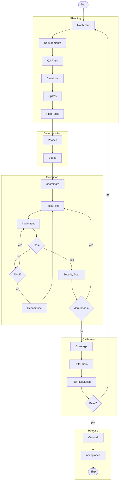

# Knowledge & Vibes

### A framework for building software with AI

---

## What This Is

A structured workflow for building real software with AI assistance. Plans are explicit, work is tracked, and verification is mandatory.

The core insight: **truth lives outside the model.** The AI's confident output is not truth. Truth is tests that pass, code that compiles, documentation that exists. Everything else is a hypothesis that needs verification.

---

## The Problem It Solves

AI-assisted development fails in predictable ways:

- **The AI builds the wrong thing** because goals weren't explicit
- **Requirements vanish mid-project** because context windows have limits
- **Multiple agents conflict** because there's no coordination protocol
- **Bugs compound silently** because there are no verification gates
- **"It works" isn't evidence** because confidence doesn't equal correctness

You can't prompt your way out of these problems. You need a system where failures get caught before they matter.

---

## How It Works

### 0. Discover Thoroughly

Before the formal pipeline, surface every decision hiding in your idea. Use relentless curiosity to interrogate frontier models until nothing is left to interpret. **The plan is complete when any capable agent could implement without asking a single clarifying question.**

> Plan as much as appropriate. Give the AI as few decisions as possible.

### 1. Plan Explicitly

Before anyone writes code, the goal is pinned down. A North Star Card captures what success looks like, what's out of scope, and when the AI should stop and ask. Requirements are written in testable terms. Decisions are recorded so they're not relitigated.

### 2. Track Everything

Work is broken into **beads**: tasks with dependencies, status, and verification requirements. Nothing gets forgotten. Nothing falls through the cracks. The graph of work is explicit and queryable.

### 3. Coordinate Agents

When multiple AI agents work simultaneously, they need a protocol. File reservations prevent conflicts. Claim/close announcements tell everyone what's taken. Calibration checkpoints catch drift before it compounds.

### 4. Verify Continuously

Tests are written before implementation (TDD). Security scans run before every commit. If something fails after three attempts, it gets decomposed or escalated rather than retried indefinitely.

---

## Full Workflow

---

## The Research Behind It

Every protocol is backed by research. 50+ papers distilled into actionable practices:

- Why TDD produces better outcomes with AI
- Why long context degrades reasoning
- Why orchestrator-worker patterns outperform single agents
- Why extended self-correction makes things worse
- Why tests should adjudicate disagreements, not rhetoric

See the [Research summaries](./research/README.md) for the full collection.

---

## What's In This Repository

| Section | What You'll Find |
|:--------|:-----------------|
| [**Discovery**](./docs/workflow/DISCOVERY.md) | Pre-pipeline: curiosity-driven architecture (start here for new projects) |
| [**Setup Guide**](./docs/guides/SETUP_GUIDE.md) | How to install and configure the toolchain |
| [**Pipeline Reference**](./docs/workflow/IDEATION_TO_PRODUCTION.md) | The complete 11-stage pipeline |
| [**Protocols**](./docs/workflow/PROTOCOLS.md) | 19 repeatable procedures for common situations |
| [**Templates**](./TEMPLATES.md) | North Star cards, requirements, ADRs, and more |
| [**Glossary**](./GLOSSARY.md) | Every term defined |

Start with [**START_HERE.md**](./START_HERE.md) for the recommended reading order.

---

## About

This framework is the distillation of three years of building with AI, starting from zero.

When GPT-3.5 launched, I was in high finance. I couldn't write a line of code. But I recognized immediately that AI was going to fundamentally change how things get built, and I wanted to be part of it.

So I went all in. Not with tutorials or bootcamps, but with a first principles approach: *What can these models actually do? Where do they fail? How do you extract every ounce of capability while catching the inevitable mistakes?*

The early days were rough. The models were weaker. The tooling didn't exist. Every technique had to be discovered through trial and error. But I stayed in it, learning, building, refining, session after session, project after project.

Three years later, I'm shipping complex applications with real users and real revenue. Not because I became a traditional developer, but because I learned how to work *with* AI in a way that produces reliable results.

This framework is everything I've learned, systematized. The protocols that prevent the common failures. The tools that catch mistakes before they ship. The workflow that turns AI-assisted coding from a gamble into a repeatable process.

**If you're technical, this will make you faster. If you're not, this is proof that you can build real things anyway.**

---

**[Follow my work →](https://x.com/YachtsmanCap)**

MIT License

