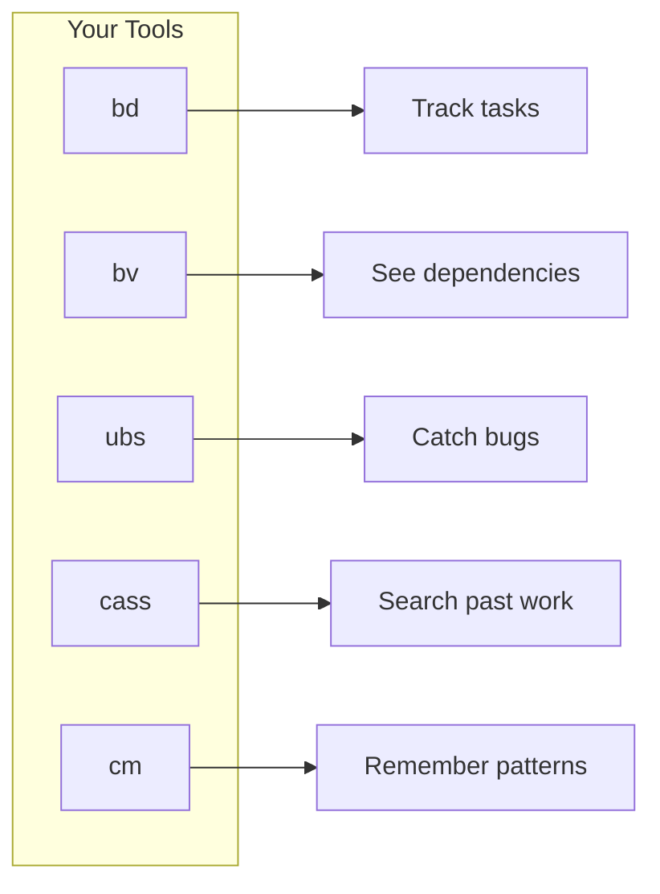
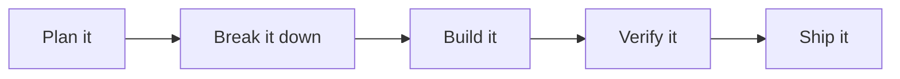

<div align="center">

# Knowledge & Vibes

### A framework for building software with AI

[](https://opensource.org/licenses/MIT)
[](./research/README.md)

</div>

---

## What This Is

A structured workflow for building real software with AI assistance. Plans are explicit, work is tracked, and verification is mandatory.

The core insight: **truth lives outside the model.** The AI's confident output is not truth. Truth is tests that pass, code that compiles, documentation that exists. Everything else is a hypothesis that needs verification.

---

## The Problem It Solves

AI-assisted development fails in predictable ways:

- **The AI builds the wrong thing** because goals weren't explicit
- **Requirements vanish mid-project** because context windows have limits
- **Multiple agents conflict** because there's no coordination protocol
- **Bugs compound silently** because there are no verification gates
- **"It works" isn't evidence** because confidence doesn't equal correctness

You can't prompt your way out of these problems. You need a system where failures get caught before they matter.

---

## How It Works

### 0. Discover Thoroughly

Before the formal pipeline, surface every decision hiding in your idea. Use relentless curiosity to interrogate frontier models until nothing is left to interpret. **The plan is complete when any capable agent could implement without asking a single clarifying question.**

> Plan as much as appropriate. Give the AI as few decisions as possible.

### 1. Plan Explicitly

Before anyone writes code, the goal is pinned down. A North Star Card captures what success looks like, what's out of scope, and when the AI should stop and ask. Requirements are written in testable terms. Decisions are recorded so they're not relitigated.

### 2. Track Everything

Work is broken into **beads**: tasks with dependencies, status, and verification requirements. Nothing gets forgotten. Nothing falls through the cracks. The graph of work is explicit and queryable.

### 3. Coordinate Agents

When multiple AI agents work simultaneously, they need a protocol. File reservations prevent conflicts. Claim/close announcements tell everyone what's taken. Calibration checkpoints catch drift before it compounds.

### 4. Verify Continuously

Tests are written before implementation (TDD). Security scans run before every commit. If something fails after three attempts, it gets decomposed or escalated rather than retried indefinitely.

---

## Full Workflow


---

## The Research Behind It

Every protocol is backed by research. 50+ papers distilled into actionable practices:

- Why TDD produces better outcomes with AI
- Why long context degrades reasoning
- Why orchestrator-worker patterns outperform single agents
- Why extended self-correction makes things worse
- Why tests should adjudicate disagreements, not rhetoric

See the [Research summaries](./research/README.md) for the full collection.

---

## What's In This Repository

| Section | What You'll Find |
|:--------|:-----------------|
| [**Discovery**](./docs/workflow/DISCOVERY.md) | Pre-pipeline: curiosity-driven architecture (start here for new projects) |
| [**Setup Guide**](./docs/guides/SETUP_GUIDE.md) | How to install and configure the toolchain |
| [**Pipeline Reference**](./docs/workflow/IDEATION_TO_PRODUCTION.md) | The complete 11-stage pipeline |
| [**Protocols**](./docs/workflow/PROTOCOLS.md) | 19 repeatable procedures for common situations |
| [**Templates**](./TEMPLATES.md) | North Star cards, requirements, ADRs, and more |
| [**Glossary**](./GLOSSARY.md) | Every term defined |

Start with [**START_HERE.md**](./START_HERE.md) for the recommended reading order.

---

## Quick Setup: Agent Prompt

Copy this entire block and give it to an AI agent to fully set up Knowledge & Vibes in your project:

<details>
<summary><strong>Click to expand full setup prompt</strong></summary>

---

**Copy everything below this line:**

---

# Knowledge & Vibes Setup Task

**Repository:** https://github.com/Mburdo/knowledge_and_vibes

Set up the complete Knowledge & Vibes framework in this project. Follow every step precisely.

## Step 1: Verify/Install Global Tools

Check if these tools exist. For any that are missing, install them.

Run this to check:

    command -v bd && echo "bd: installed" || echo "bd: MISSING"
    command -v bv && echo "bv: installed" || echo "bv: MISSING"
    command -v ubs && echo "ubs: installed" || echo "ubs: MISSING"
    command -v cass && echo "cass: installed" || echo "cass: MISSING"
    command -v cm && echo "cm: installed" || echo "cm: MISSING"

If any are missing, install them:

    # Beads (bd, bv) and Agent Mail
    curl -fsSL https://raw.githubusercontent.com/Dicklesworthstone/mcp_agent_mail/main/scripts/install.sh | bash -s -- --dir "$HOME/mcp_agent_mail" --yes

    # CASS (session search)
    curl -fsSL https://raw.githubusercontent.com/Dicklesworthstone/coding_agent_session_search/main/install.sh | bash -s -- --easy-mode

    # UBS (security scanner)
    curl -fsSL https://raw.githubusercontent.com/Dicklesworthstone/ultimate_bug_scanner/master/install.sh | bash -s -- --easy-mode

    # cm (context memory) - detect architecture and install
    mkdir -p ~/.local/bin
    ARCH=$(uname -m); OS=$(uname -s)
    if [ "$OS" = "Darwin" ] && [ "$ARCH" = "arm64" ]; then
      curl -L https://github.com/Dicklesworthstone/cass_memory_system/releases/latest/download/cass-memory-macos-arm64 -o ~/.local/bin/cm
    elif [ "$OS" = "Darwin" ]; then
      curl -L https://github.com/Dicklesworthstone/cass_memory_system/releases/latest/download/cass-memory-macos-x64 -o ~/.local/bin/cm
    else
      curl -L https://github.com/Dicklesworthstone/cass_memory_system/releases/latest/download/cass-memory-linux-x64 -o ~/.local/bin/cm
    fi
    chmod +x ~/.local/bin/cm

## Step 2: Initialize Claude Code

Run Claude Code's built-in init to create the base `.claude/` folder:

    /init

This creates `.claude/CLAUDE.md` with project-specific instructions.

## Step 3: Copy K&V Configuration

Clone K&V temporarily and copy everything needed:

    # Clone K&V repo
    git clone --depth 1 https://github.com/Mburdo/knowledge_and_vibes.git /tmp/kv-setup

    # Create PLAN directory
    mkdir -p PLAN

    # Copy all agent configuration
    cp -r /tmp/kv-setup/.claude/commands .claude/
    cp -r /tmp/kv-setup/.claude/rules .claude/
    cp -r /tmp/kv-setup/.claude/skills .claude/
    cp -r /tmp/kv-setup/.claude/templates .claude/

    # Copy AGENTS.md template
    cp /tmp/kv-setup/templates/AGENTS_TEMPLATE.md ./AGENTS.md

    # Copy planning templates into PLAN directory
    cp /tmp/kv-setup/templates/NORTH_STAR_CARD_TEMPLATE.md ./PLAN/00_north_star.md
    cp /tmp/kv-setup/templates/REQUIREMENTS_TEMPLATE.md ./PLAN/01_requirements.md
    cp /tmp/kv-setup/templates/REQUIREMENTS_QA_TEMPLATE.md ./PLAN/02_requirements_qa.md
    cp /tmp/kv-setup/templates/DECISIONS_ADRS_TEMPLATE.md ./PLAN/03_decisions.md
    cp /tmp/kv-setup/templates/RISKS_AND_SPIKES_TEMPLATE.md ./PLAN/04_risks_and_spikes.md
    cp /tmp/kv-setup/templates/TRACEABILITY_TEMPLATE.md ./PLAN/05_traceability.md

    # Clean up
    rm -rf /tmp/kv-setup

## Step 4: Initialize Beads

    bd init

## Step 5: Analyze This Project

Now analyze the current project to understand:

1. **Language/Framework**: What technologies are used? (check package.json, Cargo.toml, pyproject.toml, go.mod, etc.)
2. **Directory Structure**: What are the key directories and what do they contain?
3. **Existing Patterns**: Any coding conventions already established?
4. **Build/Test Commands**: How does the project build and test?
5. **Current State**: Is there existing code? Tests? Documentation?

Read any existing README, CONTRIBUTING, or architecture docs.

## Step 6: Customize AGENTS.md

Edit AGENTS.md with project-specific information based on your analysis:

- Replace placeholder project name with actual name
- Fill in the actual tech stack (languages, frameworks, databases)
- List key directories with their purposes
- Add the real build and test commands
- Note any coding conventions you observed
- Add project-specific restrictions (what NOT to do)

## Step 7: Create Initial Codemap (If Existing Code)

If the project has existing code, create `CODEMAPS/overview.md` with:

- Stack summary
- Directory structure with purposes
- Key files and their responsibilities
- Patterns to follow
- Build/test/run commands

## Step 8: Provide Recommendations

Based on your analysis, give me specific recommendations:

**If starting from scratch:**
- Suggest creating a North Star Card first
- Offer to help with discovery questions
- Point to docs/workflow/DISCOVERY.md

**If existing codebase:**
- Identify areas that could benefit from better structure
- Suggest creating beads for known TODOs or issues
- Recommend running `ubs .` to find existing problems

**First commands to try:**
- `/prime` - Start a working session
- `bd create "First task" -t task -p 2` - Create first task
- `bv --robot-triage` - Analyze task graph

## Step 9: Commit Setup

    git add .beads/ .claude/ AGENTS.md PLAN/
    git add CODEMAPS/ 2>/dev/null || true
    git commit -m "Initialize Knowledge & Vibes framework"

## Step 10: Present System Overview to User

Generate a personalized orientation for the human user. Use this structure:

---

# Knowledge & Vibes is Ready

**Setup complete.** Here's what you now have and how to use it.

## What Got Installed

[List tools: what was already present vs newly installed, any issues]

## Your New Toolchain



**What each does:**
- **bd** — Task tracking. Create tasks, mark them done, see what's ready.
- **bv** — Task graph analysis. Shows blockers, suggests what to work on next.
- **ubs** — Security scanner. Run before commits to catch vulnerabilities.
- **cass** — Session search. Find how you solved something before.
- **cm** — Pattern memory. Retrieves learned rules across sessions.

## Your Project Structure

```
[Show actual structure created, annotated for this specific project]
```

## The Workflow



**In practice:**
1. **Plan** — Fill out the templates in `PLAN/`. Start with the North Star.
2. **Decompose** — Break work into beads (tasks) with `bd create`.
3. **Build** — Write tests first, then implement. Scan with `ubs` before commits.
4. **Verify** — Run `/calibrate` to check for drift. `/release` when ready to ship.

## This Project

[Personalized analysis:]
- **What I found:** [tech stack, existing code, current state]
- **Key insight:** [most important thing about this codebase]
- **Watch out for:** [anything notable - missing tests, unusual patterns, etc.]

## What To Do Now

**If starting fresh:**
1. Open `PLAN/00_north_star.md` and define what success looks like
2. Fill out requirements in `PLAN/01_requirements.md`
3. Create your first task: `bd create "First task" -t task`

**If existing codebase:**
1. Run `ubs .` to see current issues
2. Create beads for known TODOs or bugs
3. Start a session with `/prime`

## Quick Reference

| You want to... | Run this |
|----------------|----------|
| Start working | `/prime` |
| See available tasks | `bd ready` |
| Create a task | `bd create "description"` |
| Finish a task | `bd close <id>` |
| Check for bugs | `ubs .` |
| Find past solutions | `cass search "query"` |

## Learn More

- Full pipeline: `docs/workflow/IDEATION_TO_PRODUCTION.md`
- All protocols: `docs/workflow/PROTOCOLS.md`
- Research behind it: `research/README.md`

---

</details>

---

## About

This framework is the distillation of three years of building with AI, starting from zero.

When GPT-3.5 launched, I was in high finance. I couldn't write a line of code. But I recognized immediately that AI was going to fundamentally change how things get built, and I wanted to be part of it.

So I went all in. Not with tutorials or bootcamps, but with a first principles approach: *What can these models actually do? Where do they fail? How do you extract every ounce of capability while catching the inevitable mistakes?*

The early days were rough. The models were weaker. The tooling didn't exist. Every technique had to be discovered through trial and error. But I stayed in it, learning, building, refining, session after session, project after project.

Three years later, I'm shipping complex applications with real users and real revenue. Not because I became a traditional developer, but because I learned how to work *with* AI in a way that produces reliable results.

This framework is everything I've learned, systematized. The protocols that prevent the common failures. The tools that catch mistakes before they ship. The workflow that turns AI-assisted coding from a gamble into a repeatable process.

**If you're technical, this will make you faster. If you're not, this is proof that you can build real things anyway.**

---

<div align="center">

**[Follow my work →](https://x.com/YachtsmanCap)**

[](https://x.com/YachtsmanCap)

MIT License

</div>
